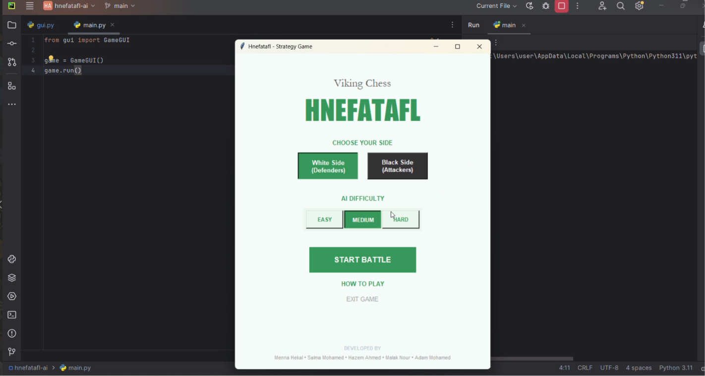
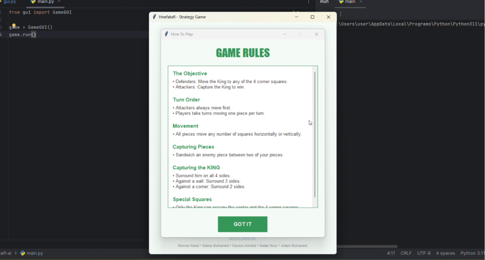
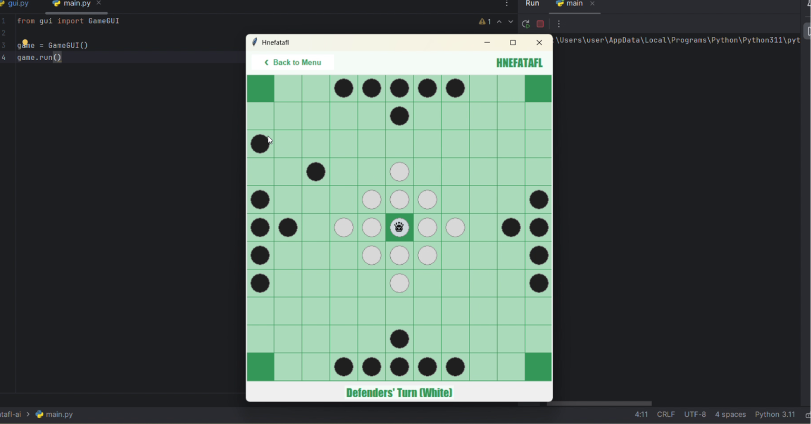
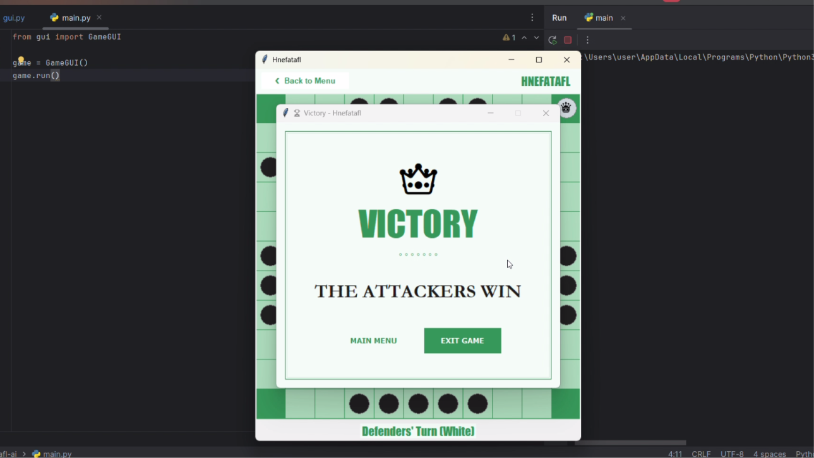

# Hnefatafl AI Game – Python GUI

## Overview

Hnefatafl, also known as Viking Chess, is a two-player asymmetric strategy game inspired by ancient Norse board games. This project was developed as part of the Artificial Intelligence course at Cairo University.

The game features a fully functional graphical user interface built with Python, Human vs Computer gameplay, and an AI opponent powered by the Alpha-Beta Pruning algorithm.

---

## Game Preview

### Main Menu



### Main Menu



### Gameplay



### Winner Screen



---

## Game Description

Hnefatafl is an asymmetric strategy board game where:

- The **Defenders (White Team)** protect the King and try to help him escape.
- The **Attackers (Black Team)** attempt to capture the King before he reaches safety.

### Board Setup

- The King starts in the center square (The Throne).
- 12 Defenders surround the King.
- 24 Attackers are positioned around the edges of the board.

### Movement Rules

- All pieces move horizontally or vertically like a rook in chess.
- Pieces can move any number of empty squares.
- Pieces cannot jump over other pieces.

### Capturing System

A piece is captured when trapped between two opponent pieces horizontally or vertically.

Special capture cases include:

- Capturing against the throne.
- Capturing against corner squares.

### Winning Conditions

- **Defenders win** if the King reaches any corner square.
- **Attackers win** if they successfully surround and capture the King.

---

## Features

- Python GUI implementation
- Human vs Computer gameplay
- AI opponent using Alpha-Beta Pruning
- Multiple difficulty levels:
  - Easy
  - Medium
  - Hard

- Turn-based game controller
- Dynamic board updates
- Win detection system
- Clean and interactive interface

---

## Technologies Used

- Python
- Tkinter GUI
- Artificial Intelligence Algorithms
- Alpha-Beta Pruning

---

## Team Members

This project was developed by:

- Menna Hekal
- Salma Mohamed
- Malak Nour
- Hazem Ahmed
- Adam Mohamed

---

## Course Information

**Faculty of Computing and Artificial Intelligence**
Cairo University
CS361 – Artificial Intelligence

---

## How to Run

1. Clone the repository:

```bash
git clone <repository-link>
```

2. Navigate to the project folder:

```bash
cd <project-folder>
```

3. Run the game:

```bash
python main.py
```

---

## Future Improvements

- Add animations and sound effects
- Improve AI strategy evaluation
- Add online multiplayer support
- Add move history and replay system

---
